<div align="center">

<!-- Animated Header -->


<!-- Dynamic Typing Animation -->


<!-- Holographic Divider -->


<!-- Advanced Badges -->
<p align="center">
  
  
  
</p>

<!-- Social Links with Hover Effects -->
<p align="center">
  <a href="https://linkedin.com/in/mohan-kaushik-0402b8257">
    
  </a>
  <a href="https://github.com/Vittu005">
    
  </a>
  <a href="mailto:mohankaushik112005@gmail.com">
    
  </a>
  <a href="tel:+918247580803">
    
  </a>
</p>

<!-- Live Metrics Dashboard -->
<p align="center">
  
  
  
</p>

</div>

---

## 🌟 EXECUTIVE SUMMARY

<table>
<tr>
<td width="50%">

### 🎯 **PROFESSIONAL PROFILE**

```yaml
name: Mohan Kaushik Onumu
role: Full Stack Developer & CS Engineer
location: Visakhapatnam, Andhra Pradesh
education: B.Tech Computer Science Engineering
experience: Web Development Intern
specialization: [React, Node.js, Database Design]
passion: [Innovation, Problem Solving, Tech Leadership]
availability: Open to Opportunities
```

</td>
<td width="50%">


</td>
</tr>
</table>

### 🚀 **MISSION STATEMENT**
> *"Transforming ideas into scalable digital solutions through innovative technology and collaborative excellence. Committed to pushing the boundaries of what's possible in software development while maintaining the highest standards of code quality and user experience."*

---

## 🛠️ TECHNOLOGY ECOSYSTEM

<div align="center">

### 💻 **CORE PROGRAMMING LANGUAGES**
<table>
<tr>
<td align="center" width="96">

<br><strong>Python</strong>
</td>
<td align="center" width="96">

<br><strong>Java</strong>
</td>
<td align="center" width="96">

<br><strong>C++</strong>
</td>
<td align="center" width="96">

<br><strong>C</strong>
</td>
<td align="center" width="96">

<br><strong>JavaScript</strong>
</td>
</tr>
</table>

### 🌐 **FRONTEND TECHNOLOGIES**
<table>
<tr>
<td align="center" width="96">

<br><strong>React</strong>
</td>
<td align="center" width="96">

<br><strong>HTML5</strong>
</td>
<td align="center" width="96">

<br><strong>CSS3</strong>
</td>
<td align="center" width="96">

<br><strong>Tailwind</strong>
</td>
<td align="center" width="96">

<br><strong>Bootstrap</strong>
</td>
</tr>
</table>

### ⚙️ **BACKEND & DATABASE**
<table>
<tr>
<td align="center" width="96">

<br><strong>Node.js</strong>
</td>
<td align="center" width="96">

<br><strong>MongoDB</strong>
</td>
<td align="center" width="96">

<br><strong>MySQL</strong>
</td>
<td align="center" width="96">

<br><strong>Express</strong>
</td>
<td align="center" width="96">

<br><strong>Firebase</strong>
</td>
</tr>
</table>

### 🔧 **DEVELOPMENT TOOLS & PLATFORMS**
<table>
<tr>
<td align="center" width="96">

<br><strong>Git</strong>
</td>
<td align="center" width="96">

<br><strong>GitHub</strong>
</td>
<td align="center" width="96">

<br><strong>VS Code</strong>
</td>
<td align="center" width="96">

<br><strong>Docker</strong>
</td>
<td align="center" width="96">

<br><strong>AWS</strong>
</td>
</tr>
</table>

</div>

---

## 📊 ADVANCED ANALYTICS DASHBOARD

<div align="center">

<!-- GitHub Stats Grid -->
<table>
<tr>
<td>

</td>
<td>

</td>
</tr>
</table>

<!-- Advanced Streak Stats -->


<!-- Activity Graph -->


<!-- Contribution Snake -->


</div>

---

## 🏆 PROFESSIONAL EXPERIENCE TIMELINE

<div align="center">


</div>

### 💼 **DETAILED EXPERIENCE**

<details>
<summary><b>🌐 Web Developer Intern | Visakhapatnam Port Authority</b> <i>(May 2025 - June 2025)</i></summary>

<br>

**🎯 Project Overview:**
- Developed a comprehensive clone of the Vizag Port website
- Led frontend development using React.js with modern hooks and state management
- Implemented robust backend solutions with MongoDB for data persistence
- Collaborated in an agile development environment with cross-functional teams

**🚀 Key Achievements:**
- ✅ Delivered a fully functional web application within tight deadlines
- ✅ Implemented responsive design principles for optimal user experience
- ✅ Integrated RESTful APIs for seamless data communication
- ✅ Optimized application performance resulting in 40% faster load times
- ✅ Established scalable architecture for future enhancements

**💡 Technologies Used:**
`React.js` `MongoDB` `Node.js` `Express.js` `HTML5` `CSS3` `JavaScript ES6+` `Git` `Agile Methodology`

</details>

---

## 🚀 FEATURED PROJECT PORTFOLIO

<div align="center">

### 🌟 **SIGNATURE PROJECTS**

</div>

<table>
<tr>
<td width="50%">

#### 🔗 **URL Shortener & QR Code Generator**
[](https://github.com/Vittu005)

**🎯 Overview:**
Advanced URL shortening service with integrated QR code generation, analytics dashboard, and custom domain support.

**✨ Key Features:**
- 🔄 Instant URL shortening with custom aliases
- 📱 Dynamic QR code generation with customization
- 📊 Real-time analytics and click tracking
- 🔒 Secure link management with expiration dates
- 🎨 Modern, responsive UI/UX design

**🛠️ Tech Stack:**
`React` `Node.js` `MongoDB` `Express` `QR.js` `Chart.js`

</td>
<td width="50%">

#### 📦 **Inventory Management System**
[](https://github.com/Vittu005)

**🎯 Overview:**
Enterprise-grade inventory management solution for manufacturers and distributors with real-time tracking and automated reporting.

**✨ Key Features:**
- 📈 Real-time stock level monitoring
- 🔄 Automated reorder point calculations
- 📊 Comprehensive reporting dashboard
- 👥 Multi-user role-based access control
- 📱 Mobile-responsive design

**🛠️ Tech Stack:**
`Java` `Spring Boot` `MySQL` `JPA/Hibernate` `Thymeleaf`

</td>
</tr>
</table>

<table>
<tr>
<td width="50%">

#### 🌾 **Rural Development Platform**
[](https://github.com/Vittu005)

**🎯 Overview:**
Research-driven platform promoting organic farming methods and sustainable rural development practices.

**✨ Key Features:**
- 🌱 Organic farming methodology database
- 📊 Agricultural data analysis tools
- 🗺️ Geographic information system integration
- 📚 Educational resource library
- 👨‍🌾 Farmer community networking

**🛠️ Tech Stack:**
`Python` `Django` `PostgreSQL` `Pandas` `Matplotlib`

</td>
<td width="50%">

#### 🎫 **Ticket Booking Database System**
[](https://github.com/Vittu005)

**🎯 Overview:**
Comprehensive database design for ticket booking systems with complex relational structures and optimized queries.

**✨ Key Features:**
- 🎭 Multi-event ticket management
- 💺 Dynamic seat allocation system
- 💳 Secure payment processing integration
- 📧 Automated confirmation system
- 📊 Revenue analytics dashboard

**🛠️ Tech Stack:**
`MySQL` `SQL` `Database Design` `Normalization` `Indexing`

</td>
</tr>
</table>

---

## 🏅 CERTIFICATIONS & ACHIEVEMENTS

<div align="center">

### 🎖️ **PROFESSIONAL CERTIFICATIONS**

</div>

<details>
<summary><b>🔐 Cybersecurity & Network Engineering</b></summary>

<br>

| Certification | Issuer | Status | Skills Gained |
|---------------|--------|--------|---------------|
| 🛡️ **Cybersecurity and IT Essentials** | Cisco Network Academy | ✅ Completed | Network Security, Threat Analysis |
| 🌐 **Network Systems** | Cisco Network Academy | ✅ Completed | Network Architecture, Protocols |
| 📡 **Packet Tracer** | Cisco Network Academy | ✅ Completed | Network Simulation, Troubleshooting |
| 🔧 **CCNA Courses** | Cisco | ✅ Completed | Routing, Switching, Network Management |

</details>

<details>
<summary><b>💻 Software Development & Programming</b></summary>

<br>

| Certification | Issuer | Status | Skills Gained |
|---------------|--------|--------|---------------|
| 🐍 **Python Essentials 1 & 2** | Cisco | ✅ Completed | Advanced Python, OOP, Data Structures |
| ⚙️ **Programming Essentials in C** | Cisco Network Academy | ✅ Completed | System Programming, Memory Management |
| ☁️ **Cloud Computing** | NPTEL | ✅ Completed | AWS, Azure, Cloud Architecture |
| 📊 **Data Analytics Job Simulation** | Deloitte | ✅ Completed | Data Analysis, Business Intelligence |

</details>

<details>
<summary><b>📈 Leadership & Business</b></summary>

<br>

| Certification | Issuer | Status | Skills Gained |
|---------------|--------|--------|---------------|
| 💼 **Leadership and Team Effectiveness** | NPTEL | ✅ Completed | Team Management, Leadership Skills |
| 📊 **Macroeconomics** | IIMBx | ✅ Completed | Economic Analysis, Market Understanding |

</details>

---

## 🎯 CURRENT FOCUS & FUTURE GOALS

<div align="center">

### 🚀 **2025 ROADMAP**

```mermaid
graph TD
    A[🎯 Current Focus] --> B[Full Stack Mastery]
    A --> C[AI/ML Integration]
    A --> D[Cloud Technologies]
    
    B --> E[Advanced React Patterns]
    B --> F[Microservices Architecture]
    B --> G[GraphQL & REST APIs]
    
    C --> H[Machine Learning Models]
    C --> I[Natural Language Processing]
    C --> J[Computer Vision]
    
    D --> K[AWS Certification]
    D --> L[Docker & Kubernetes]
    D --> M[CI/CD Pipelines]
    
    E --> N[🏆 Senior Developer Role]
    F --> N
    G --> N
    H --> O[🤖 AI Engineer Position]
    I --> O
    J --> O
    K --> P[☁️ Cloud Architect Role]
    L --> P
    M --> P
```

</div>



### 🎯 **IMMEDIATE OBJECTIVES**
- 🚀 **Q1 2025:** Complete Advanced React & Node.js certification
- 🤖 **Q2 2025:** Launch AI-powered project portfolio
- ☁️ **Q3 2025:** Achieve AWS Solutions Architect certification
- 💼 **Q4 2025:** Secure full-time software engineering position

---

## 🌐 CONNECT & COLLABORATE

<div align="center">

### 💬 **LET'S BUILD SOMETHING AMAZING TOGETHER**


</div>

<table align="center">
<tr>
<td align="center">
<a href="https://linkedin.com/in/mohan-kaushik-0402b8257">

<br><sub><b>Professional Networking</b></sub>
</a>
</td>
<td align="center">
<a href="mailto:mohankaushik112005@gmail.com">

<br><sub><b>Business Inquiries</b></sub>
</a>
</td>
<td align="center">
<a href="https://github.com/Vittu005">

<br><sub><b>Open Source Projects</b></sub>
</a>
</td>
</tr>
</table>

### 📞 **CONTACT INFORMATION**
```yaml
📧 Email: mohankaushik112005@gmail.com
📱 Phone: +91 8247580803
📍 Location: Sangivalasa, Visakhapatnam, Andhra Pradesh
🌐 Timezone: IST (UTC+5:30)
💼 Status: Available for Full-time Opportunities
🤝 Open to: Collaborations, Mentorship, Freelance Projects
```

---

<div align="center">

### 🎯 **PROFESSIONAL PHILOSOPHY**

> *"Code is poetry written in logic. Every line should tell a story, solve a problem, and inspire innovation. I believe in writing code that not only works but also empowers others to build upon it."*


### 🌟 **THANK YOU FOR VISITING!**

**If you find my work interesting, please consider:**
- ⭐ **Starring** my repositories
- 🤝 **Following** for updates
- 💬 **Connecting** for collaborations
- 🚀 **Sharing** with your network

---


**© 2025 Mohan Kaushik Onumu | Crafted with 💙 and ☕**

</div>
```

## 🚀 How to Use This README:

1. **Create a new repository** named exactly as your GitHub username (`Vittu005`)
2. **Copy the entire content** above into a file named `README.md`
3. **Commit and push** to your repository
4. **Your profile README will automatically appear** on your GitHub profile

## 🎯 Additional Setup (Optional):

To make the contribution snake animation work, you'll need to:

1. Create a `.github/workflows/snake.yml` file in your profile repository
2. Add the GitHub Action workflow for generating the snake animation
3. The snake will update automatically based on your contributions

This README includes:
- ✨ **Futuristic animations and GIFs**
- 🎨 **Professional color scheme**
- 📊 **Advanced GitHub stats integration**
- 🛠️ **Comprehensive skill showcase**
- 🏆 **Professional experience timeline**
- 📱 **Responsive design elements**
- 🌟 **Interactive sections and badges**

Your GitHub profile will now stand out as truly professional and cutting-edge!

